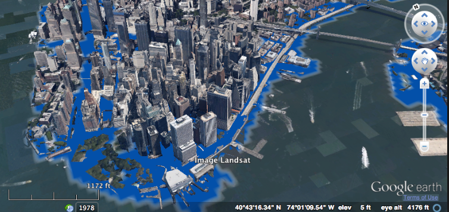

```{r load-pkgs,eval=TRUE,message=FALSE,include=FALSE}
options(nytimes_cg_key = "YOURKEYHERE")
options(nytimes_as_key = "YOURKEYHERE")
options(nytimes_cf_key = "YOURKEYHERE")
options(nytimes_geo_key = "a4bc718568ce5a22f07e74a86c165765:14:65002889")

library(rtimes)
library(jsonlite)
library(httr)
library(stringr)
library(plyr)
library(knitr)
library(sp)
library(ggplot2)
```

New York Times journalist Justin Gillis has published a series of articles on the
impact of Global Warming.  The most recent one appeared on March 31.  It chronicles
the view of many scientists that the Antacrctica ice sheet is melting and the
profound effect this will have on sea levels.  What is striking about this analysis 
is the claim that the melting process will take place over the cours of decades, 
not centuries. 

http://www.nytimes.com/2016/03/31/science/global-warming-antarctica-ice-sheet-sea-level-rise.html?_r=0

If these predictions are true, what are the consequences to global popultion centers
in coastal and low-lying areas globally?  This is what the following exercise attempts 
to illustrate using geo and semantic web-scraping techniques provided by the NY Times API.


##Search on articles by Justin Gillis
```{r semantic-search, eval=TRUE, message=FALSE}
semantic_key <- "&api-key=621746db4c8f966bdf1f67dca6aa3b90:13:65002889"
url <- "http://api.nytimes.com/svc/semantic/v2/concept/name/nytd_per/Gillis,%20Justin.json?fields=all"
json_file <- paste0(url, semantic_key)
json_data_raw <- fromJSON(json_file)

#review meta-data 
df_nyt_meta <- data.frame(
  status = c(unlist(json_data_raw[1])),
  copyright = c(unlist(json_data_raw[2])),
  num_results = c(unlist(json_data_raw[3]))
)

#display meta-data
kable(df_nyt_meta, align = 'l')
kable(data.frame(Metadata=names(json_data_raw$results)), align = 'l')
```

##Extracts of content from articles
```{r parse-results, eval=TRUE, message=FALSE}
#get interesting info from sublists
df_article_bodies <- data.frame(Excerpts = json_data_raw$results$article_list$results[[1]][[1]])
df_article_nytd_des <- data.frame(article_desc = unlist(json_data_raw$results$article_list$results[[1]][[3]]$nytd_des))
df_article_nytd_geo <- data.frame(article_geo = unlist(json_data_raw$results$article_list$results[[1]][[3]]$nytd_geo))
df_results<-data.frame(json_data_raw[['results']])
df_geocodes <- data.frame(json_data_raw[[4]][[11]])

#display article bodies by Justin Gillis on global warming.
kable(df_article_bodies, align='l')
```

##World cities by elevation & population
```{r geo-search, eval=TRUE, message=FALSE}
loc <- geo_search(feature_class = 'P')
df_location <- data.frame(loc)
df_location[35,12] <- 8400000 # population new york city
df_location[35,11] <- 33 # elevation new york city
df_location[33,11] <- 6 # elevation Shanghai
df_location[46,11] <- 25 # elevation Buenos Aires
df_location[47,11] <- 14 # elevation Mumbai
df_location[31,11] <- 2250 # elevation Mexico City
df_location[53,11] <- 40 # elevation Istanbul
df_location[22,11] <- 7786 # elevation Moscow

df_location <- df_location[order(-df_location$data.population),]
df_location['size'] <- df_location$data.population/5000000
kable(head(df_location[,c(5,11,12)], n=10), align='l')
```

##World cities vulnerability to flooding
```{r geo-plot-world, eval=TRUE, message=FALSE}
#change the location data into a SpatialPointsDataFrame
coords <- cbind(Longitude = as.numeric(as.character(df_location$data.longitude)), 
                Latitude = as.numeric(as.character(df_location$data.latitude)))
df_location.pts <- SpatialPointsDataFrame(coords, df_location, proj4string = CRS("+init=epsg:4326"))
#plot(df_location.pts, pch = ".", col = "darkred")

mp <- NULL
mapWorld <- borders("world", colour="gray50", fill="gray60") # create a layer of borders
mp <- ggplot() +   mapWorld

#Now Layer the cities on top
mp <- mp + geom_point(aes(x=df_location$data.longitude, y=df_location$data.latitude, color=df_location$data.elevation), size=df_location$size)
mp <- mp +  scale_colour_gradient(limits=c(0, 200), low="red", na.value = "antiquewhite", guide = "colourbar")  
mp
```

http://www.agcs.allianz.com/assets/PDFs/GRD/GRD%20individual%20articles/022014/SpecialTopicEarth_the-heat-is-on.pdf


##US cities vulnerability to flooding
```{r geo-plot-us, eval=TRUE, message=FALSE}
df_location <- subset(df_location, data.country_code == 'US')
df_location <- df_location[df_location$data.name != "Honolulu", ]
df_location['size'] <- df_location$data.population/1000000
kable(head(df_location[,c(5,11,12)], n=10), align='l')

#change the location data into a SpatialPointsDataFrame
coords <- cbind(Longitude = as.numeric(as.character(df_location$data.longitude)), 
                Latitude = as.numeric(as.character(df_location$data.latitude)))
df_location.pts <- SpatialPointsDataFrame(coords, df_location, proj4string = CRS("+init=epsg:4326"))
#plot(df_location.pts, pch = ".", col = "darkred")

mp <- NULL
mapUSA <- borders('state', colour="gray50", fill="gray60")
mp <- ggplot() +   mapUSA

#Now Layer the cities on top
mp <- mp + geom_point(aes(x=df_location$data.longitude, y=df_location$data.latitude, color=df_location$data.elevation), size=df_location$size)
mp <- mp + scale_colour_gradient(limits=c(0, 200), low="red", na.value = "antiquewhite", guide = "colourbar")
mp
```

##NY cities vulnerability to flooding
```{r geo-plot-ny, eval=TRUE}
df_location <- subset(df_location, data.admin_code1 == 'NY')
df_location['size'] <- df_location$data.population/1000000
kable(df_location[,c(5,11,12)], align='l')

coords <- cbind(Longitude = as.numeric(as.character(df_location$data.longitude)), 
                Latitude = as.numeric(as.character(df_location$data.latitude)))
df_location.pts <- SpatialPointsDataFrame(coords, df_location, proj4string = CRS("+init=epsg:4326"))
#plot(df_location.pts, pch = ".", col = "darkred")

mp <- NULL
mapNY <- borders("county","new york", colour="gray50", fill="gray60") 
mp <- ggplot() +   mapNY

#Now Layer the cities on top
mp <- mp + geom_point(aes(x=df_location$data.longitude, y=df_location$data.latitude, color=df_location$data.elevation), size=df_location$size)
mp <- mp + scale_colour_gradient(limits=c(0, 200), low="red", na.value = "antiquewhite", guide = "colourbar")
mp
```

## Implications
What do the implications of severe flooding look like for a major city like New 
York?  The following study was conducted by Hunter College using data collected 
by FEMA.

Mr. Gillis's article reports that the prevailing view of scientists studying the 
the melting of the Antarctic ice shelf is that sea-levels will rise an average of 
3 feet by the end of the century, accelerating mid-century.  Note that many of
the most highly populated cities are along coastal areas and are within flood
surge range of these projections.


http://carsi.hunter.cuny.edu/project/hurricane-sandy-3d-flood-map/


