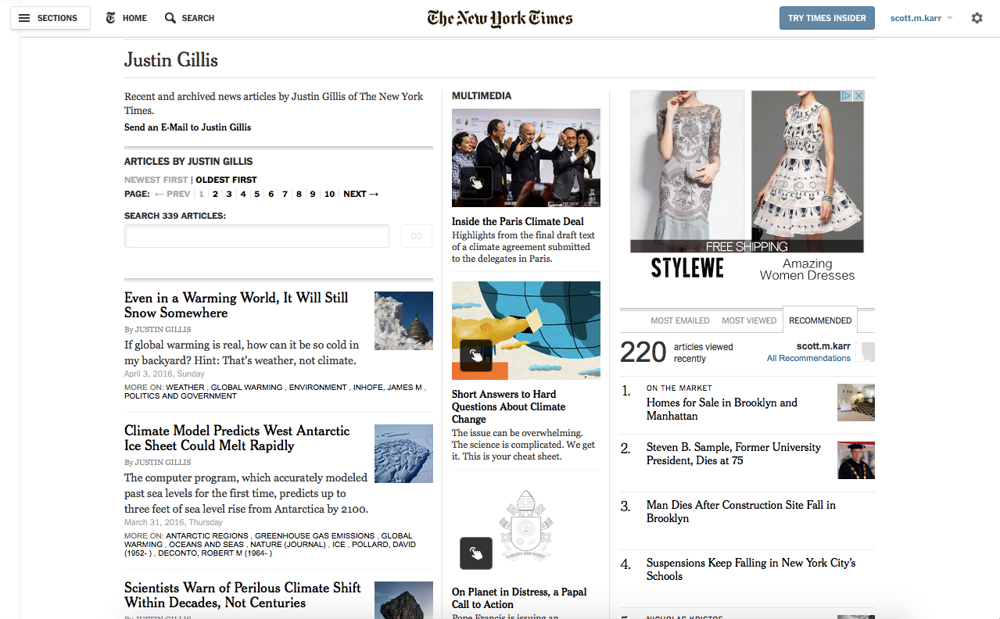
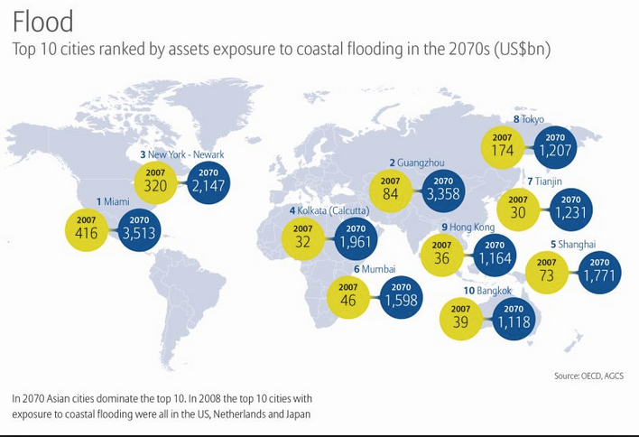
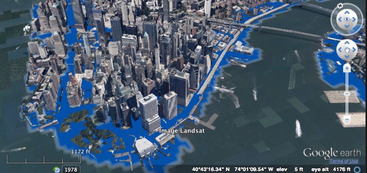

# What coastal cities are most affected if the Antarctica ice-sheet melts?
Scott Karr  
April 2, 2016  


New York Times journalist Justin Gillis has published a series of articles on the
impact of Global Warming.  The most recent one appeared on March 31.  It chronicles
the view of many scientists that the Antacrctica ice sheet is melting and the
profound effect this will have on sea levels.  What is striking about this analysis 
is the claim that the melting process will take place over the cours of decades, 
not centuries. 

http://www.nytimes.com/2016/03/31/science/global-warming-antarctica-ice-sheet-sea-level-rise.html?_r=0

If these predictions are true, what are the consequences to global popultion centers
in coastal and low-lying areas globally?  This is what the following exercise attempts 
to illustrate using geo and semantic web-scraping techniques provided by the NY Times API.



##Search on articles by Justin Gillis

```r
semantic_key <- "&api-key=621746db4c8f966bdf1f67dca6aa3b90:13:65002889"
url <- "http://api.nytimes.com/svc/semantic/v2/concept/name/nytd_per/Gillis,%20Justin.json?fields=all"
json_file <- paste0(url, semantic_key)
json_data_raw <- fromJSON(json_file)

#review meta-data 
df_nyt_meta <- data.frame(
  status = c(unlist(json_data_raw[1])),
  copyright = c(unlist(json_data_raw[2])),
  num_results = c(unlist(json_data_raw[3]))
)

#display meta-data
kable(df_nyt_meta, align = 'l')
```

         status   copyright                                                             num_results 
-------  -------  --------------------------------------------------------------------  ------------
status   OK       Copyright (c) 2015 The New York Times Company. All Rights Reserved.   1           

```r
kable(data.frame(Metadata=names(json_data_raw$results)), align = 'l')
```


Metadata         
-----------------
concept_id       
concept_name     
is_times_tag     
concept_status   
vernacular       
concept_type     
concept_created  
concept_updated  
teragram         
variants         
pages            
search_api_query 
article_list     

##Extracts of content from articles

```r
#get interesting info from sublists
df_article_bodies <- data.frame(Excerpts = json_data_raw$results$article_list$results[[1]][[1]])
df_article_nytd_des <- data.frame(article_desc = unlist(json_data_raw$results$article_list$results[[1]][[3]]$nytd_des))
df_article_nytd_geo <- data.frame(article_geo = unlist(json_data_raw$results$article_list$results[[1]][[3]]$nytd_geo))
df_results<-data.frame(json_data_raw[['results']])
df_geocodes <- data.frame(json_data_raw[[4]][[11]])

#display article bodies by Justin Gillis on global warming.
kable(df_article_bodies, align='l')
```


Excerpts                                                                                                                                                               
-----------------------------------------------------------------------------------------------------------------------------------------------------------------------
A host of approaches to limiting global warming emerge as world leaders gather in Paris to launch two weeks of climate talks.                                          
A powerful El Niño and greenhouse-driven warming combine to push 2015 into the record books.                                                                           
A new study of Antarctic ice and warming finds humanity will have to write off today’s coastal cities centuries from now if it chooses to keep burning fossil fuels.   
The latest global warming report from the U.N. climate panel helpfully clarifies risks but largely misses a key factor in driving an energy transformation — research. 
Adam Bryant recently became editor of The Times’s expanded team covering the environment. We asked him how he is approaching the position.                             
The new U.N. climate panel report on impacts of global warming sees substantial shifts already under way and much more to come.                                        
A closer look at the science behind the fighting over whether global warming has shaped California’s drought.                                                          
A new modeling study finds that by mid-century many places on Earth, starting in the tropics, will have a fundamentally warmer climate.                                
A fresh look at studies finding a less potent warming from the continuing buildup of greenhouse gases.                                                                 
A famous curve of carbon dioxide levels is close to passing a milestone.                                                                                               

##World cities by elevation & population

```r
loc <- geo_search(feature_class = 'P')
df_location <- data.frame(loc)
df_location[35,12] <- 8400000 # population new york city
df_location[35,11] <- 33 # elevation new york city
df_location[33,11] <- 6 # elevation Shanghai
df_location[46,11] <- 25 # elevation Buenos Aires
df_location[47,11] <- 14 # elevation Mumbai
df_location[31,11] <- 2250 # elevation Mexico City
df_location[53,11] <- 40 # elevation Istanbul
df_location[22,11] <- 7786 # elevation Moscow

df_location <- df_location[order(-df_location$data.population),]
df_location['size'] <- df_location$data.population/5000000
kable(head(df_location[,c(5,11,12)], n=10), align='l')
```

     data.concept_name                    data.elevation   data.population 
---  -----------------------------------  ---------------  ----------------
33   Shanghai (China)                     6                14608512        
46   Buenos Aires (Argentina)             25               13076300        
47   Mumbai (India)                       14               12691836        
31   Mexico City (Mexico)                 2250             11285654        
53   Istanbul (Turkey)                    40               11174257        
22   Moscow (Russia)                      7786             10381222        
42   Seoul (South Korea)                  NA               10349312        
88   Jakarta (Indonesia)                  NA               8540121         
35   Times Square and 42nd Street (NYC)   33               8400000         
18   Tokyo (Japan)                        NA               8336599         

##World cities vulnerability to flooding

```r
#change the location data into a SpatialPointsDataFrame
coords <- cbind(Longitude = as.numeric(as.character(df_location$data.longitude)), 
                Latitude = as.numeric(as.character(df_location$data.latitude)))
df_location.pts <- SpatialPointsDataFrame(coords, df_location, proj4string = CRS("+init=epsg:4326"))
#plot(df_location.pts, pch = ".", col = "darkred")

mp <- NULL
mapWorld <- borders("world", colour="gray50", fill="gray60") # create a layer of borders
mp <- ggplot() +   mapWorld

#Now Layer the cities on top
mp <- mp + geom_point(aes(x=df_location$data.longitude, y=df_location$data.latitude, color=df_location$data.elevation), size=df_location$size)
mp <- mp +  scale_colour_gradient(limits=c(0, 200), low="red", na.value = "antiquewhite", guide = "colourbar")  
mp
```

```
## Warning: Removed 1 rows containing missing values (geom_point).
```

<!-- -->

http://www.agcs.allianz.com/assets/PDFs/GRD/GRD%20individual%20articles/022014/SpecialTopicEarth_the-heat-is-on.pdf


##US cities vulnerability to flooding

```r
df_location <- subset(df_location, data.country_code == 'US')
df_location <- df_location[df_location$data.name != "Honolulu", ]
df_location['size'] <- df_location$data.population/1000000
kable(head(df_location[,c(5,11,12)], n=10), align='l')
```

     data.concept_name                    data.elevation   data.population 
---  -----------------------------------  ---------------  ----------------
35   Times Square and 42nd Street (NYC)   33               8400000         
1    Los Angeles (Calif)                  89               3694820         
3    Chicago (Ill)                        179              2841952         
13   Houston (Tex)                        12               2027712         
14   Philadelphia (Pa)                    12               1517550         
52   Phoenix (Ariz)                       331              1321045         
32   San Diego (Calif)                    20               1223400         
39   Dallas (Tex)                         128              1211704         
10   Detroit (Mich)                       183              951270          
5    San Francisco (Calif)                16               732072          

```r
#change the location data into a SpatialPointsDataFrame
coords <- cbind(Longitude = as.numeric(as.character(df_location$data.longitude)), 
                Latitude = as.numeric(as.character(df_location$data.latitude)))
df_location.pts <- SpatialPointsDataFrame(coords, df_location, proj4string = CRS("+init=epsg:4326"))
#plot(df_location.pts, pch = ".", col = "darkred")

mp <- NULL
mapUSA <- borders('state', colour="gray50", fill="gray60")
mp <- ggplot() +   mapUSA

#Now Layer the cities on top
mp <- mp + geom_point(aes(x=df_location$data.longitude, y=df_location$data.latitude, color=df_location$data.elevation), size=df_location$size)
mp <- mp + scale_colour_gradient(limits=c(0, 200), low="red", na.value = "antiquewhite", guide = "colourbar")
mp
```

```
## Warning: Removed 1 rows containing missing values (geom_point).
```

<!-- -->

##NY cities vulnerability to flooding

```r
df_location <- subset(df_location, data.admin_code1 == 'NY')
df_location['size'] <- df_location$data.population/1000000
kable(df_location[,c(5,11,12)], align='l')
```

     data.concept_name                    data.elevation   data.population 
---  -----------------------------------  ---------------  ----------------
35   Times Square and 42nd Street (NYC)   33               8400000         
71   Buffalo (NY)                         183              279557          
38   Yonkers (NY)                         25               197818          
15   Albany (NY)                          45               95658           
50   White Plains (NY)                    65               57260           
89   Bedford-Stuyvesant (NYC)             15               NA              

```r
coords <- cbind(Longitude = as.numeric(as.character(df_location$data.longitude)), 
                Latitude = as.numeric(as.character(df_location$data.latitude)))
df_location.pts <- SpatialPointsDataFrame(coords, df_location, proj4string = CRS("+init=epsg:4326"))
#plot(df_location.pts, pch = ".", col = "darkred")

mp <- NULL
mapNY <- borders("county","new york", colour="gray50", fill="gray60") 
mp <- ggplot() +   mapNY

#Now Layer the cities on top
mp <- mp + geom_point(aes(x=df_location$data.longitude, y=df_location$data.latitude, color=df_location$data.elevation), size=df_location$size)
mp <- mp + scale_colour_gradient(limits=c(0, 200), low="red", na.value = "antiquewhite", guide = "colourbar")
mp
```

```
## Warning: Removed 1 rows containing missing values (geom_point).
```

<!-- -->

## Implications
What do the implications of severe flooding look like for a major city like New 
York?  The following study was conducted by Hunter College using data collected 
by FEMA.

Mr. Gillis's article reports that the prevailing view of scientists studying the 
the melting of the Antarctic ice shelf is that sea-levels will rise an average of 
3 feet by the end of the century, accelerating mid-century.  Note that many of
the most highly populated cities are along coastal areas and are within flood
surge range of these projections.


http://carsi.hunter.cuny.edu/project/hurricane-sandy-3d-flood-map/



